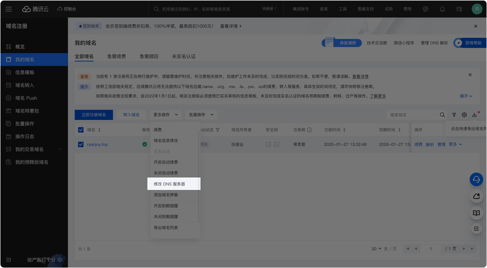

# 博客搭建：Vitepress一站式部署方案

> [!tip] 作者说
> 由于网上的教程纷繁复杂，给前期不会部署的我造成了不小的困惑，索性这里写一篇一站式部署解决方案，希望后来者可以通过遵循此篇，成功完成网站的部署。

由于文章篇幅稍长，编写可能有些地方不够详尽，如果您对文章有建议，可以评论或者到我的 `Repo` 提出讨论；如果您愿意贡献此文，欢迎您的 `PR` 。

## 域名购买

推荐使用 `腾讯云` ，因为我懒得写别的教程了……

### 简介

腾讯公司旗下的产品，提供云服务器、云存储、云数据库、域名注册等基础云服务

官网： <https://cloud.tencent.com/>

### 注册

[腾讯云首页](https://cloud.tencent.com/) => 产品 => 域名注册

自己想一个域名搜索，被注册了就换一个，直到有中意的

购买完成后，右上角点击进入 `控制台`  => 域名注册 => 我的域名

你就可以看到刚刚注册成功的域名了

### 域名解析

腾讯云域名解析，使用的是全资收购的 [DNSPod](https://www.dnspod.cn/)

直接点 `快速添加解析` ，记录值填 `你的主机IP` 即可

解析成功后，结果如下

## 部署到 Vercel

[Vercel](https://vercel.com/) 是一个现代化的静态网站托管平台，它提供了免费的静态网站托管服务，并且支持自动化部署。以下是将 VitePress 项目部署到 Vercel 的步骤：

### 准备工作

1. **GitHub 仓库**：确保你的 VitePress 项目已经推送到 GitHub 仓库。
2. **Vercel 账号**：使用 GitHub 账号登录 [Vercel](https://vercel.com/)，身份选择 `Hobby` 即可。

### 导入项目

1. 在 Vercel 控制台点击右上角 **"Add New Project"**。
2. 选择你要部署的 GitHub 仓库。
3. Vercel 会自动检测到这是一个 VitePress 项目。

 > [!tip] 作者说
 > 这里项目导入建议直接导入整个项目源文件，不要导入 `.vitepress/dist` 文件夹。这取决于你在 Github 仓库中上传的代码是什么。

原因是直接上传源文件，Vercel 会自动执行相应的 `build` 命令，自动部署。

### 配置构建设置

在项目配置页面：

1. **Project Name:** 设置你的项目名称
2. **Framework Preset**: 选择 `VitePress`
3. **Root Directory:** `./`
4. **Build Command:** 设置为 `npm run build` 或 `pnpm run build` 。这里根据你自己的 `package.json` 文件的内容进行配置。

	我的 `package.json` 内容如下：

	

	因此我的配置为 `pnpm build` 。

5. **Output Directory**: 设置为 `.vitepress/dist`
6. **Install Command**: 设置为 `npm install` 或 `pnpm install`

### 部署

1. 点击 **"Deploy"** 按钮开始部署
2. Vercel 会自动进行构建和部署
3. 部署完成后，你会得到一个 `.vercel.app` 结尾的域名

如果你挂了梯子，你点击这一域名便可以成功访问你的网站了，但是如果你没有梯子，便会被墙。如图所示：

### 自定义域名

选择 `Domain` => `Add` ，填入你自己的域名即可。我这里使用的是 ` ryanjoy.top ` 。

### 自动部署

Vercel 会自动监听你的 GitHub 仓库：

- 当你推送新的提交到 `main` 分支时，Vercel 会自动重新部署
- 当你创建新的 `Pull Request` 时，Vercel 会自动创建预览部署

### 性能优化

Vercel 提供了一些内置的性能优化：

- 自动 CDN 分发
- 自动 HTTPS
- 自动压缩
- 边缘网络加速

### 🎯 部署检查清单

- [x] GitHub 仓库设置正确
- [x] 构建命令配置正确
- [x] 输出目录设置正确
- [x] HTTPS 证书自动配置
- [x] 自动部署触发正常

## 套壳 CF

### 简介

我们常说的“套 CF”就是给域名套一层 `Cloudflare` 。[**Cloudflare**](https://www.cloudflare.com/zh-cn/)（Cloudflare, Inc.）是一家总部位于[旧金山]( https://zh.wikipedia.org/wiki/%E8%88%8A%E9%87%91%E5%B1%B1 "旧金山")的跨国科技企业，以向客户提供基于[反向代理]( https://zh.wikipedia.org/wiki/%E5%8F%8D%E5%90%91%E4%BB%A3%E7%90%86 "反向代理")的[内容分发网络]( https://zh.wikipedia.org/wiki/%E5%85%A7%E5%AE%B9%E5%82%B3%E9%81%9E%E7%B6%B2%E8%B7%AF "内容分发网络")（Content Delivery Network, **CDN**）及 [分布式域名解析服务](https://zh.wikipedia.org/wiki/%E5%9F%9F%E5%90%8D%E7%B3%BB%E7%BB%9F)（Distributed Domain Name Server）为主要业务。

常见的**CDN**服务商还有 [又拍云](https://www.upyun.com/)、[七牛云](https://www.qiniu.com/)、[腾讯云COS](https://cloud.tencent.com/act/pro/cos)、[阿里云OSS](https://www.aliyun.com/product/oss)等。

### 注册-登录

这一步需要科学上网，相信对你没有问题，省略不写。

### 如何配置

右上角 `添加` => 现有域

输入我们之前注册好的 [域名](博客搭建：Vitepress一站式部署方案.md#注册) ，点击继续

方案选择 `FREE`

`开始快速扫描`

后面提示我们更改 DNS 服务器

回到腾讯云。打开域名界面，勾选域名，修改DNS服务器。

填入 `Cloudflare` 给出的服务器编码

点击确定，一直确认，最后提交即可。

::: details   当前域名未设置正确的 DNS 服务器，DNS 解析服务未生效。

出现图上提示

忽视即可。因为腾讯云自带的有 DNS 解析服务，我们现在使用了 `Cloudflare` 的解析，就不用再维护腾讯云的 DNS 解析配置了。

**后续的“二级域名解析”等 DNS 解析服务，我们都只需要在 `Cloudflare` 之中进行，不用配置腾讯云。**
:::

等待一会，会收到 `Cloudflare` 的邮件

这表示你已经成功激活 `Cloudflare` 的服务。 `Cloudflare` 控制台会显示如下

点击左侧 DNS => 记录。可以看到之前腾讯云我们配置的 DNS 解析自动被识别到这里了。

## 切换域名

由于我先前把博客部署在 `ryanjoy.top` 上，也即我的根域名上，为了给以后更多网站（个人主页、项目站、项目 Wiki ……）提供空间，我们这里最好把博客部署在 `blog.ryanjoy.top` 的二级域名上。

这一操作需要在 **Cloudflare、Vercel 和 腾讯云** 三个地方进行调整，以完成 **VitePress 站点域名从 `ryanjoy.top` 迁移到 `blog.ryanjoy.top`** 的操作。

### 在 Cloudflare 添加 `blog.ryanjoy.top` 解析

Cloudflare 负责 DNS 解析，因此我们需要在 **Cloudflare** 里添加新的 `CNAME` 记录：

1. **进入 Cloudflare 控制台**，选择 `ryanjoy.top` 域名。
2. **切换到 "DNS" 选项卡**。
3. **添加一条新的 `CNAME` 记录**：
    - **名称 (Name)**：`blog`
    - **目标 (Target)**：`cname.vercel-dns.com`
    - **代理状态 (Proxy status)**：⚠ **保持"仅 DNS" (灰色云朵) 状态，不要启用 Cloudflare 代理（橙色云朵）**，否则可能会导致 Vercel 无法正确处理。（bug 解决看这里！）{.marker-underline}
4. **保存修改**。

### 在 Vercel 绑定 `blog.ryanjoy.top` 域名

现在我们需要告诉 **Vercel**，我们的 VitePress 站点应该使用 `blog.ryanjoy.top`

1. **进入 [Vercel 控制台](https://vercel.com/)**，打开我们的 VitePress 项目。
2. **进入 "Settings" → "Domains"** 页面。
3. **点击 `ryanjoy.top` 域名后的"Edit"**，输入 `blog.ryanjoy.top` ，然后点击 "Add"。
4. **Vercel 可能会提示我们需要配置 DNS 解析**，但由于我们已经在 **Cloudflare** 添加了 `CNAME` 记录，理论上会自动检测成功。
5. **如果 Vercel 显示 "Invalid Configuration"**：
    - 我们可以点击 **"View Instructions"**，按照 Vercel 提供的 CNAME 解析方式检查是否正确。
    - 确保 Cloudflare 里 `blog.ryanjoy.top` 的 CNAME 解析 **未启用 Cloudflare 代理**（应该是 **"DNS only"**)。

成功之后，会显示如下

### 访问 `blog.ryanjoy.top` 验证是否生效

- 在 **浏览器中访问 `blog.ryanjoy.top`**，查看是否能够正确加载 VitePress 站点。
- 我们也可以在 `powershell` 使用 **`nslookup blog.ryanjoy.top` 或 `ping blog.ryanjoy.top` 检查解析是否生效**。
- 一般 DNS 解析 **可能需要几分钟到 24 小时生效**，如果访问不成功可以稍等一会儿。

### 🎯 总结

1. **Cloudflare**：添加 `blog.ryanjoy.top` 的 CNAME，指向 `cname.vercel-dns.com` ，并 **关闭 Cloudflare 代理**（使用"DNS only"）。
2. **Vercel**：在项目里添加 `blog.ryanjoy.top` 作为自定义域名。

这样，VitePress 站点就会成功迁移到 `blog.ryanjoy.top` 🎉。

::: details 为什么要关闭 Cloudflare 代理（使用 "DNS only"）？

Cloudflare 提供 **代理模式（橙色云朵）** 和 **DNS 解析模式（灰色云朵，DNS only）**，但在 **Vercel 部署的 VitePress 站点** 上，**必须使用"DNS only"**，原因如下：

**1. Vercel 需要直接管理 HTTPS 证书**

- **Vercel 自带自动 HTTPS 证书管理**，当你在 Vercel 添加 `blog.ryanjoy.top` 后，Vercel 会自动为该域名生成并绑定 **Let's Encrypt SSL 证书**。
- **如果启用 Cloudflare 代理（橙色云朵）**，Vercel 可能无法正确检测到域名的真实 IP，导致：
    - SSL 证书验证失败（Vercel 提示 `Invalid Configuration`）。
    - 站点可能会出现 **403、525 SSL handshake failed 等错误**。

**2. 避免 CNAME 解析问题**

- 在 Cloudflare **代理模式（橙色云朵）** 下，Cloudflare **会把 CNAME 解析转换为 A 记录**，这样：
    - Vercel 无法正确识别 `blog.ryanjoy.top` 绑定到它的 IP 地址，导致解析失败。
    - 可能会导致访问时出现 **"Not Found"** 或 **Vercel 识别错误的 IP**。

**3. Cloudflare 代理可能影响 Vercel 的动态功能**

- Vercel 提供了一些动态功能（如 Edge Functions、动态 API 路由），如果 Cloudflare 代理开启：
    - 可能会影响 Vercel 的**缓存策略**，导致数据不更新或加载异常。
    - Cloudflare 可能会拦截 Vercel 的 WebSocket 连接等功能。

**如何解决？**

1. **在 Cloudflare DNS 配置里，找到 `blog.ryanjoy.top` 这条 CNAME 记录。**
2. **确保代理状态为 "DNS only"**（**灰色云朵**）。
3. **等待 DNS 解析生效**（通常几分钟到 24 小时）。
4. **在 Vercel 重新检查 `blog.ryanjoy.top` 的绑定状态**。

**总结**

✅ **正确做法**：使用 **DNS only**（灰色云朵），让 Vercel 正确处理 SSL 证书和域名解析。  
❌ **错误做法**：启用 Cloudflare 代理（橙色云朵），会导致 **Vercel SSL 失败、CNAME 解析异常、动态功能受影响**。

只要你保持 **Cloudflare 的 CNAME 解析为 "DNS only"**，Vercel 就能正确绑定 `blog.ryanjoy.top` ，让你的 VitePress 站点稳定运行 🚀！{.marker-underline}

:::

## 🎉特别鸣谢

- [@Yiov](https://yiov.top/website/pages/vercel.html) 大佬
- [炸了么](https://zhale.me/)