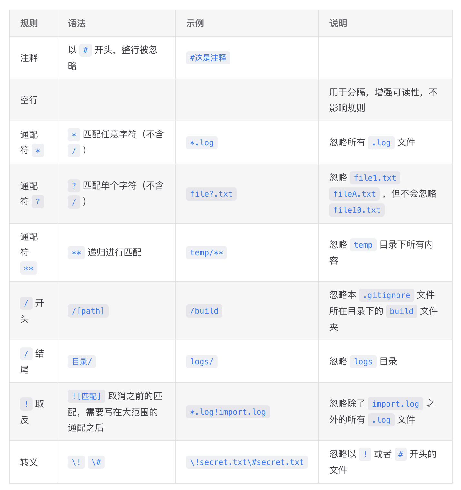
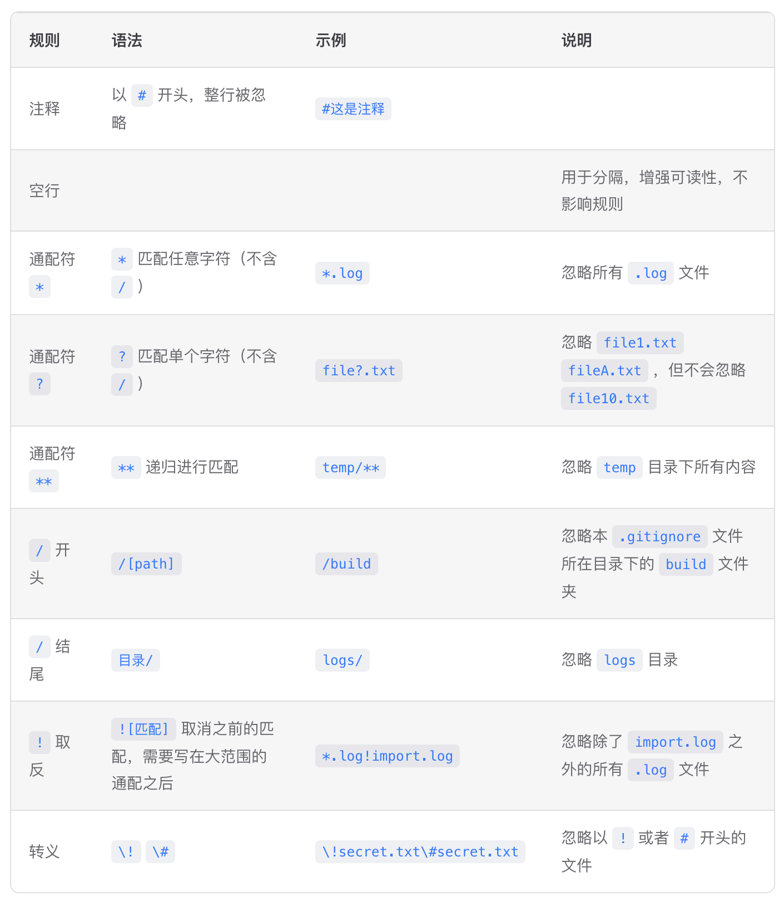

# 博客美化：Table美化方案

## 效果对比

|                   原生样式                   |                   美化样式                   |
| :--------------------------------------: | :--------------------------------------: |
|  |  |

可见，美化后表格自动居中，且表格各列宽自动适配并拉伸。

## 配置

### `<div>` 自动包裹 `<table>`

为了方便设置样式，我们需要给全局 `<table>` 标签外自动包裹上一层 `<div>` 标签，进而为控制此 `<div>` 的样式做准备。

这里我选择采用 `Vitepress` 原生的 `markdown` 扩展配置。你只需要在对应位置添加**高亮代码**即可。

```ts [.vitepress/config.mts]
import { defineConfig, type DefaultTheme } from "vitepress";
// ...
export default defineConfig({
  // ...
  markdown: {
	// ...
    config: (md) => {
      // 保存原有的table渲染器 // [!code ++]
      const defaultRender = // [!code ++]
        md.renderer.rules.table_open || // [!code ++]
        ((tokens, idx) => { // [!code ++]
          return "<table>"; // [!code ++]
        }); // [!code ++]
      // 自定义table渲染 // [!code ++]
      md.renderer.rules.table_open = (tokens, idx) => { // [!code ++]
        // 获取用户自定义的类名 // [!code ++]
        const className = "custom-table-container"; // [!code ++]
        return `<div class="${className}"><table>`; // [!code ++]
      }; // [!code ++]
      // 确保table结束标签后，div标签正确关闭 // [!code ++]
      const defaultTableClose = // [!code ++]
        md.renderer.rules.table_close || // [!code ++]
        ((tokens, idx, options, env, self) => { // [!code ++]
          return "</table>"; // [!code ++]
        }); // [!code ++]
      md.renderer.rules.table_close = (tokens, idx, options, env, self) => { // [!code ++]
        return `${defaultTableClose(tokens, idx, options, env, self)}</div>`; // [!code ++]
      }; // [!code ++]
      // ...
    },
    // ...
  },
});
```

### 设置全局 `<table>` 样式

创建样式文件 `📄:.vitepress/theme/style/tableCustom.css` ，填写内容如下：

```css [tableCustom.css]
/* 表格容器样式 */
.vp-doc .custom-table-container {
    min-width: 90%;
    margin: 1.5rem auto;      
    overflow-x: auto;
    border-radius: 8px; /* 表格容器圆角 */
    border: 1px solid var(--custom-border); /* 外边框 */
}

/* 表格基础样式 */
.vp-doc table {
    display: table;          
    width: 100%;            
    table-layout: auto;     
    border-collapse: collapse;  
    margin: 0;             
    font-size: 14px; /* 稍微减小字号，更精致 */
}

/* 表头样式 */
.vp-doc thead {
    background-color: var(--custom-block-info-bg);  /* 使用自定义的淡灰色背景 */
    border-bottom: 1px solid var(--custom-border);
}

/* 表头单元格样式 */
.vp-doc th {
    white-space: nowrap;     
    text-align: left;        
    padding: 12px 16px;       
    margin: 0;             
    font-weight: 600;
    color: var(--vp-c-text-1);
    border: none; /* 移除默认边框，只保留底边框 */
}

/* 表格单元格样式 */
.vp-doc td {
    padding: 12px 16px;       
    text-align: left;        
    margin: 0;             
    border: none;
    border-top: 1px solid var(--custom-border); /* 行间分隔线 */
    color: var(--vp-c-text-2);
}

/* 表格行 Hover 效果 - Notion/MacOS 风格 */
.vp-doc tbody tr:hover {
    background-color: var(--vp-c-bg-soft);
}

/* 确保表格在小屏幕上也能正常显示 */
@media (max-width: 768px) {
    .vp-doc .custom-table-container {
        margin: 1rem auto;  
        padding: 0;         
        border: none; /* 移动端移除外边框以增加可视面积 */
    }
}
```

在总样式文件 `📄:.vitepress/theme/style/index.css` 中进行引入

```css [index.css]
@import './tableCustom.css';
```

## 配置说明

本次更新引入了以下 CSS 变量，请确保你的主题（通常在 `colorCustom.css` 或 `var.css`）中已定义这些变量，以保证最佳显示效果：

*   `--custom-border`: 表格容器外边框及行间分隔线颜色。
*   `--custom-block-info-bg`: 表头背景色，推荐使用淡灰色。
*   `--vp-c-text-1`: 主文本颜色（VitePress 默认变量）。
*   `--vp-c-text-2`: 次要文本颜色（VitePress 默认变量）。
*   `--vp-c-bg-soft`: 表格行 Hover 背景色（VitePress 默认变量）。

## 效果验证

在你的 `markdown` 文档中，粘贴下述内容，验证效果

```md [example.md]
|  这   | 是一  | 个用于验证 |  的  | 表格demo |
| :--: | :-: | :---: | :-: | :----: |
|  宽度  |  会  |   跟   |  随  |   列宽   |
| 自动调整 |  ，  | 并且表格  | 整体  |   居中   |
```