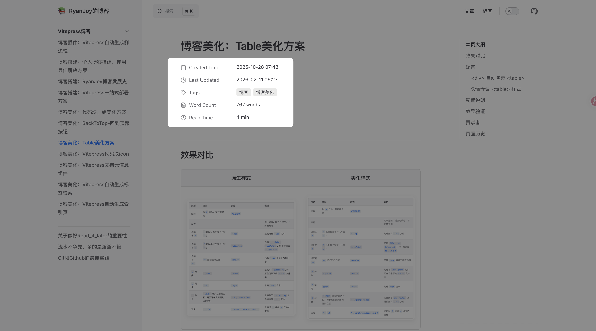

# 博客美化：Vitepress文档元信息组件

## 效果展示



> **注**：最新版本采用了类 Notion 的极简设计风格，支持显示创建时间、更新时间、标签（Pill样式）、字数统计及预估阅读时间。

## 前提条件

由于本组件与标签检索功能联动，建议先配置 [博客美化：Vitepress自动生成标签检索](博客美化：Vitepress自动生成标签检索.md)。

## 组件定义

### 1. 日期处理工具

由于组件需要处理日期格式，需要确保 `.vitepress/theme/components/PostList/dateUtils.ts` 文件存在。如果该文件已在其他教程中创建，请确保包含以下 `splitDate` 等核心函数。

新建或更新 `📄:.vitepress/theme/components/PostList/dateUtils.ts`：

```ts [dateUtils.ts]
import { ContentData } from "vitepress";

// 日期结构接口
export interface DateComponents {
    year: number;
    month: string;
    day: string;
    hour: string;
    minute: string;
    second: string;
}

// 文章接口定义
export interface Post {
    url: string;
    frontmatter: {
        title: string;
        tags?: string[];
        createAt: DateComponents;
        updateAt: DateComponents;
    };
}

// 日期处理函数：将日期字符串转换为结构化对象
export function splitDate(dateStr: string | Date): DateComponents {
    const date = new Date(dateStr);
    return {
        year: date.getUTCFullYear(),
        month: (date.getUTCMonth() + 1).toString().padStart(2, "0"),
        day: date.getUTCDate().toString().padStart(2, "0"),
        hour: date.getUTCHours().toString().padStart(2, "0"),
        minute: date.getUTCMinutes().toString().padStart(2, "0"),
        second: date.getUTCSeconds().toString().padStart(2, "0"),
    };
}

// 处理原始文章数据的函数
export function processPost(post: ContentData): Post {
    return {
        url: post.url,
        frontmatter: {
            title: post.frontmatter.title,
            tags: post.frontmatter.tags,
            createAt: splitDate(post.frontmatter.createAt),
            updateAt: splitDate(post.frontmatter.updateAt),
        },
    };
}

// 获取日期的时间戳数值
export function getDateValue(d: DateComponents): number {
    return new Date(
        `${d.year}-${d.month}-${d.day}T${d.hour}:${d.minute}:${d.second}Z`
    ).getTime();
}

// 格式化日期显示
export function formatDate(d: DateComponents): string {
    return `${d.year}.${d.month}.${d.day} ${d.hour}:${d.minute}:${d.second}`;
}

// 按日期排序的函数 (降序)
export function sortPostsByDate(posts: Post[]): Post[] {
    return posts.sort((a, b) => {
        return getDateValue(b.frontmatter.createAt) - getDateValue(a.frontmatter.createAt);
    });
}
```

### 2. 元信息统计脚本

此脚本负责统计字数（支持 CJK 字符优化）、图片数量并计算预估阅读时间。

新建或更新 `📄:.vitepress/theme/components/ArticleMetadata/functions.ts`：

```ts [functions.ts]
/**
 * Word counting and read time estimation utilities
 * Refined for better CJK support and cleaner implementation
 */

// Matches CJK characters or alphanumeric words
const pattern = /[a-zA-Z0-9_\u0392-\u03C9\u00C0-\u00FF\u0600-\u06FF\u0400-\u04FF]+|[\u4E00-\u9FFF\u3400-\u4DBF\uF900-\uFAFF\u3040-\u309F\uAC00-\uD7AF]+/g

export interface ArticleStats {
    wordCount: number;
    imageCount: number;
    readTimeMinutes: number;
}

/**
 * Counts words in a string.
 * CJK characters are counted individually.
 * Latin/other words are counted by whitespace/punctuation boundaries.
 */
export function countWord(data: string): number {
    const matches = data.match(pattern)
    if (!matches) {
        return 0
    }
    
    let count = 0
    for (const match of matches) {
        // If the match starts with a CJK character code (approximate range check)
        // 0x4E00 is the start of common CJK Unified Ideographs
        if (match.charCodeAt(0) >= 0x4E00) {
            count += match.length
        } else {
            // For non-CJK (like English words), count as 1 word regardless of length
            count += 1
        }
    }
    return count
}

/**
 * Estimates reading time for images.
 * Strategy: 
 * - First 10 images: 10s per image
 * - Subsequent images: 3s per image
 */
export function calculateImageTime(imageCount: number): number {
    if (imageCount <= 10) {
        return imageCount * 10
    }
    // 100s for first 10 images + 3s for each subsequent image
    return 100 + (imageCount - 10) * 3
}

/**
 * Estimates reading time for text.
 * Standard speed: 275 words per minute (CN/EN mix)
 */
export function calculateWordTime(wordCount: number): number {
    return (wordCount / 275) * 60 // returns seconds
}

export function calculateReadTime(wordCount: number, imageCount: number): number {
    const wordTimeSec = calculateWordTime(wordCount)
    const imageTimeSec = calculateImageTime(imageCount)
    return Math.ceil((wordTimeSec + imageTimeSec) / 60)
}

export function getArticleStats(content: string, imageCount: number): ArticleStats {
    const wordCount = countWord(content)
    return {
        wordCount,
        imageCount,
        readTimeMinutes: calculateReadTime(wordCount, imageCount)
    }
}
```

**更新说明**：
- **CJK 字符支持**：优化了字数统计逻辑，将 CJK 字符单独计数，非 CJK 单词按空格分隔计数，统计更准确。
- **阅读时间算法**：
  - 文字：按 275 字/分钟计算。
  - 图片：前 10 张按 10 秒/张计算，超过 10 张部分按 3 秒/张计算（类 Medium 算法）。

### 3. 元信息组件

这是核心 Vue 组件，采用 Notion 风格的列表布局，支持响应式与暗黑模式。

新建或更新 `📄:.vitepress/theme/components/ArticleMetadata/ArticleMetadata.vue`：

```vue [ArticleMetadata.vue]
<script lang="ts" setup>
import { useData, useRouter } from 'vitepress'
import { computed, ref, onMounted } from 'vue'
import { getArticleStats, type ArticleStats } from './functions'
import { splitDate } from '../PostList/dateUtils'

const { page } = useData()
const router = useRouter()

const date = computed(() => page.value.frontmatter.createAt)
const updateDate = computed(() => {
    const val = page.value.lastUpdated || page.value.frontmatter.updateAt
    if (typeof val === 'number') return new Date(val)
    return val
})
const formattedDate = computed(() => date.value ? splitDate(date.value) : null)
const formattedUpdateDate = computed(() => updateDate.value ? splitDate(updateDate.value) : null)
const tags = computed(() => page.value.frontmatter.tags || [])

const articleStats = ref<ArticleStats>({
    wordCount: 0,
    imageCount: 0,
    readTimeMinutes: 0
})

function analyze() {
    // Clean up any existing meta description elements
    document.querySelectorAll('.meta-des').forEach(v => v.remove())
    
    // Analyze content from the DOM after mounting
    const docDomContainer = window.document.querySelector('#VPContent')
    const imgs = docDomContainer?.querySelectorAll<HTMLImageElement>(
        '.content-container .main img'
    )
    const words = docDomContainer?.querySelector('.content-container .main')?.textContent || ''

    articleStats.value = getArticleStats(words, imgs?.length || 0)
}

onMounted(() => {
    analyze()
})

const handleTagClick = (tag: string) => {
    router.go(`/otherDocs/tagCloud.html?tag=${encodeURIComponent(tag)}`)
}
</script>


<template>
    <div class="article-metadata-container">
        
        <!-- Created At -->
        <div class="meta-row" v-if="formattedDate">
            <div class="meta-label">
                <span class="meta-icon">
                    <svg viewBox="0 0 24 24" width="16" height="16" stroke="currentColor" stroke-width="2" fill="none" stroke-linecap="round" stroke-linejoin="round"><rect x="3" y="4" width="18" height="18" rx="2" ry="2"/><line x1="16" y1="2" x2="16" y2="6"/><line x1="8" y1="2" x2="8" y2="6"/><line x1="3" y1="10" x2="21" y2="10"/></svg>
                </span>
                <span class="label-text">Created Time</span>
            </div>
            <div class="meta-value">
                {{ formattedDate.year }}-{{ formattedDate.month }}-{{ formattedDate.day }} {{ formattedDate.hour }}:{{ formattedDate.minute }}
            </div>
        </div>

        <!-- Updated At -->
        <div class="meta-row" v-if="formattedUpdateDate">
            <div class="meta-label">
                <span class="meta-icon">
                    <svg viewBox="0 0 24 24" width="16" height="16" stroke="currentColor" stroke-width="2" fill="none" stroke-linecap="round" stroke-linejoin="round"><circle cx="12" cy="12" r="10"/><polyline points="12 6 12 12 16 14"/></svg>
                </span>
                <span class="label-text">Last Updated</span>
            </div>
            <div class="meta-value">
                {{ formattedUpdateDate.year }}-{{ formattedUpdateDate.month }}-{{ formattedUpdateDate.day }} {{ formattedUpdateDate.hour }}:{{ formattedUpdateDate.minute }}
            </div>
        </div>

        <!-- Tags -->
        <div class="meta-row" v-if="tags.length > 0">
            <div class="meta-label">
                <span class="meta-icon">
                    <svg viewBox="0 0 24 24" width="16" height="16" stroke="currentColor" stroke-width="2" fill="none" stroke-linecap="round" stroke-linejoin="round"><path d="M20.59 13.41l-7.17 7.17a2 2 0 0 1-2.83 0L2 12V2h10l8.59 8.59a2 2 0 0 1 0 2.82z"/><line x1="7" y1="7" x2="7.01" y2="7"/></svg>
                </span>
                <span class="label-text">Tags</span>
            </div>
            <div class="meta-value tags-wrapper">
                <span class="tag-pill" 
                      v-for="tag in tags" 
                      :key="tag" 
                      @click="handleTagClick(tag)">
                    {{ tag }}
                </span>
            </div>
        </div>

        <!-- Word Count & Read Time (Combined or Separate) -->
        <div class="meta-row">
            <div class="meta-label">
                <span class="meta-icon">
                    <svg viewBox="0 0 24 24" width="16" height="16" stroke="currentColor" stroke-width="2" fill="none" stroke-linecap="round" stroke-linejoin="round"><path d="M14 2H6a2 2 0 0 0-2 2v16a2 2 0 0 0 2 2h12a2 2 0 0 0 2-2V8z"/><polyline points="14 2 14 8 20 8"/><line x1="16" y1="13" x2="8" y2="13"/><line x1="16" y1="17" x2="8" y2="17"/><polyline points="10 9 9 9 8 9"/></svg>
                </span>
                <span class="label-text">Word Count</span>
            </div>
            <div class="meta-value">{{ articleStats.wordCount }} words</div>
        </div>
        
         <div class="meta-row">
            <div class="meta-label">
                <span class="meta-icon">
                    <svg viewBox="0 0 24 24" width="16" height="16" stroke="currentColor" stroke-width="2" fill="none" stroke-linecap="round" stroke-linejoin="round"><circle cx="12" cy="12" r="10"/><polyline points="12 6 12 12 16 14"/></svg>
                </span>
                <span class="label-text">Read Time</span>
            </div>
            <div class="meta-value">{{ articleStats.readTimeMinutes }} min</div>
        </div>

    </div>
</template>


<style scoped>
.article-metadata-container {
    display: flex;
    flex-direction: column;
    gap: 0px; /* Notion rows are tight */
    margin-top: 24px;
    margin-bottom: 32px;
    font-family: -apple-system, BlinkMacSystemFont, "Segoe UI", Roboto, Helvetica, Arial, sans-serif;
    font-size: 14px;
    color: var(--vp-c-text-1);
}

.meta-row {
    display: flex;
    align-items: flex-start; /* Align top for multiline values */
    padding: 6px 0;
    min-height: 32px;
}

.meta-label {
    display: flex;
    align-items: center;
    width: 160px; /* Fixed width for labels */
    flex-shrink: 0;
    color: var(--vp-c-text-2);
    gap: 8px;
}

.meta-icon {
    display: flex;
    align-items: center;
    justify-content: center;
    color: var(--vp-c-text-2);
    opacity: 0.8;
}

.label-text {
    font-size: 14px;
    font-weight: 400;
}

.meta-value {
    flex-grow: 1;
    color: var(--vp-c-text-1);
    font-weight: 400;
    display: flex;
    align-items: center;
    flex-wrap: wrap;
    gap: 6px;
    line-height: 1.5; /* Better reading for text */
}

.tags-wrapper {
    display: flex;
    flex-wrap: wrap;
    gap: 6px;
}

.tag-pill {
    display: inline-flex;
    align-items: center;
    padding: 2px 8px;
    border-radius: 4px;
    background-color: rgba(120, 119, 116, 0.15); /* Notion-like gray pill */
    color: var(--vp-c-text-1);
    font-size: 13px;
    cursor: pointer;
    transition: all 0.2s ease;
    line-height: 1.4;
}

.tag-pill:hover {
    background-color: rgba(120, 119, 116, 0.25);
}

/* Dark mode adjustment for pills if needed, but rgba works well */
:root.dark .tag-pill {
    background-color: rgba(255, 255, 255, 0.1);
}
:root.dark .tag-pill:hover {
    background-color: rgba(255, 255, 255, 0.15);
}
</style>
```

**功能特性**：
- **Notion 风格 UI**：使用行布局、SVG 图标和灰色 Pill 样式标签，视觉干扰更小。
- **双时间显示**：支持显示 `Created Time`（创建时间）和 `Last Updated`（最后更新时间）。
- **标签交互**：点击标签可跳转到标签云页面（需配合 [tagCloud.md](../../otherDocs/tagCloud.md) 使用）。
- **自动统计**：组件挂载后自动扫描 `#VPContent` 内容进行字数和图片统计。

## 版本同步记录

- **同步时间**：2026-02-11
- **变更摘要**：
  - 同步 `ArticleMetadata.vue` 最新代码，采用 Notion 风格 UI。
  - 同步 `functions.ts` 优化后的字数统计与阅读时间算法。
  - 补充 `dateUtils.ts` 依赖代码。
  - 修正过时的样式配置说明。
