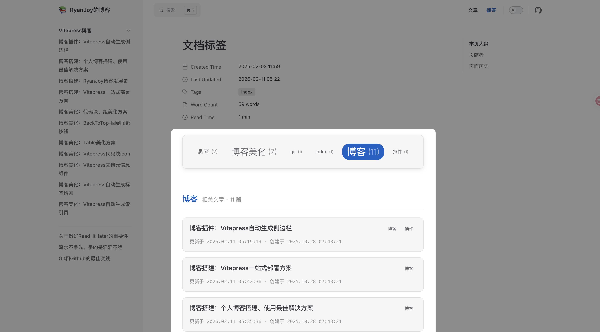

# 博客美化：Vitepress自动生成标签检索

## 效果展示



上方显示 `tagCloud` ，点击 `tag` 下方列出对应文章列表。

## 前提条件

本解决方案是依赖于 `markdown` 文档的 `frontmatter` 配置，因此，要求每一个 `markdown` 文档都要有下述开头：

```md [example.md]
---
title:
creatAt: YYYY-MM-DD HH:mm:ss
updateAt: YYYY-MM-DD HH:mm:ss
tags:
  - 标签1
  - 标签2
  - ...
---
```

> 我之前写过更详细的教程，详见 [文件配置](博客搭建：个人博客搭建、使用最佳解决方案.md#文件配置)、[文档结构明晰](博客美化：Vitepress自动生成索引页.md#文档结构明晰)。

## 组件定义

### 时间处理脚本

新建 `📄:.vitepress/theme/components/PostList/dateUtils.ts` 文件，复制粘贴下述内容

```ts [dateUtils.ts]
import { ContentData } from "vitepress";

// 日期结构接口
export interface DateComponents {
    year: number;
    month: string;
    day: string;
    hour: string;
    minute: string;
    second: string;
}

// 文章接口定义
export interface Post {
    url: string;
    frontmatter: {
        title: string;
        tags?: string[];
        createAt: DateComponents;
        updateAt: DateComponents;
    };
}

// 日期处理函数：将日期字符串转换为结构化对象
export function splitDate(dateStr: string | Date): DateComponents {
    const date = new Date(dateStr);
    return {
        year: date.getUTCFullYear(),
        month: (date.getUTCMonth() + 1).toString().padStart(2, "0"),
        day: date.getUTCDate().toString().padStart(2, "0"),
        hour: date.getUTCHours().toString().padStart(2, "0"),
        minute: date.getUTCMinutes().toString().padStart(2, "0"),
        second: date.getUTCSeconds().toString().padStart(2, "0"),
    };
}

// 处理原始文章数据的函数
export function processPost(post: ContentData): Post {
    return {
        url: post.url,
        frontmatter: {
            title: post.frontmatter.title,
            tags: post.frontmatter.tags,
            createAt: splitDate(post.frontmatter.createAt),
            updateAt: splitDate(post.frontmatter.updateAt),
        },
    };
}

// 获取日期的时间戳数值
export function getDateValue(d: DateComponents): number {
    return new Date(
        `${d.year}-${d.month}-${d.day}T${d.hour}:${d.minute}:${d.second}Z`
    ).getTime();
}

// 格式化日期显示
export function formatDate(d: DateComponents): string {
    return `${d.year}.${d.month}.${d.day} ${d.hour}:${d.minute}:${d.second}`;
}

// 按日期排序的函数 (降序)
export function sortPostsByDate(posts: Post[]): Post[] {
    return posts.sort((a, b) => {
        return getDateValue(b.frontmatter.createAt) - getDateValue(a.frontmatter.createAt);
    });
}
```

### 标签数据脚本

新建 `📄:.vitepress/theme/components/PostList/tags.data.ts` 文件，复制粘贴下述内容

```ts [tags.data.ts]
import { ContentData, createContentLoader } from "vitepress";
import { processPost, sortPostsByDate, Post } from "./dateUtils";

// 标签接口定义
export interface Tag {
    name: string;
    count: number;
    posts: Post[];
    size: number;
}

// 根据文章数量计算标签大小
const calculateSize = (count: number, maxCount: number): number => {
    const minSize = 0.8;
    const maxSize = 1.7;
    
    // 处理边界情况
    if (count <= 1) return minSize;
    if (count >= maxCount) return maxSize;
    if (maxCount <= 1) return minSize;

    // 使用对数函数使大小变化更平滑
    const logBase = Math.E;
    const normalizedCount = Math.log(count) / Math.log(logBase);
    const normalizedMax = Math.log(maxCount) / Math.log(logBase);
    
    // 使用 sigmoid-like 函数使变化更加平滑
    const scale = normalizedCount / normalizedMax;
    const smoothScale = 1 / (1 + Math.exp(-5 * (scale - 0.5)));
    
    return minSize + (maxSize - minSize) * smoothScale;
};

declare const data: Tag[];
export { data };

export default createContentLoader("docs/**/*.md", { // [!code warning]
    transform(raw: ContentData[]) {
        // 创建标签映射表
        const tagMap = new Map<string, { count: number; posts: Post[] }>();

        // 处理所有文章并统计标签信息
        raw.forEach((rawPost) => {
            const post = processPost(rawPost);
            const tags = post.frontmatter.tags || [];
            tags.forEach((tag) => {
                if (!tagMap.has(tag)) {
                    tagMap.set(tag, { count: 0, posts: [] });
                }
                const tagData = tagMap.get(tag)!;
                tagData.count++;
                tagData.posts.push(post);
            });
        });

        // 计算最大文章数
        const maxCount = Math.max(
            ...Array.from(tagMap.values()).map((t) => t.count)
        );

        // 转换数据结构并添加样式属性
        const tags: Tag[] = Array.from(tagMap.entries())
            .map(([name, data]) => ({
                name,
                count: data.count,
                posts: sortPostsByDate(data.posts),
                size: calculateSize(data.count, maxCount),
            }))
            .sort(() => Math.random() - 0.5); // 随机打乱标签顺序

        return tags;
    },
});
```

注意到，我这里高亮了一行代码，主要关注 `docs/**/*.md` 。这一参数表示项目根目录下 `docs/` 文件夹内所有 `.md` 文件。如果你需要检索某一指定文件夹如 `📂:'/笔记'` 下的所有 `.md` 文件，那么你需要修改参数为 `'笔记/**/*.md'` ，实际配置需要根据你的项目结构具体调整。

### 文章列表组件

> [!tip] 作者说
> 这里把「文章列表组件」和「标签云组件」进行解耦，主要目的是为了**复用**「文章列表组件」。

> [!info] 更新说明 (2026-02-11 v1.1.0)
> 组件接口定义已统一抽取至 `dateUtils.ts`，Props 定义更加简洁，样式全面升级为 macOS/Notion 风格。

新建 `📄:.vitepress/theme/components/PostList/PostList.vue` ，复制粘贴下述内容：

```vue [PostList.vue]
<script setup lang="ts">
import { formatDate, Post } from './dateUtils'

defineProps<{
    posts: Post[]
}>()
</script>

<template>
    <ul class="post-list-ul">
        <a class="post-link" v-for="post of posts" :key="post.url" :href="post.url">
            <li class="post-item">
                <div class="post-content">
                    <div class="post-header">
                        <span class="post-title">{{ post.frontmatter.title }}</span>
                        <div class="post-tags" v-if="post.frontmatter.tags?.length">
                            <span
                                v-for="(tag, index) in post.frontmatter.tags"
                                :key="tag"
                                class="tag-item"
                            >
                                {{ tag }}
                            </span>
                        </div>
                    </div>
                    <div class="post-meta">
                        <span class="meta-item">
                            更新于 {{ formatDate(post.frontmatter.updateAt) }}
                        </span>
                        <span class="meta-separator">·</span>
                        <span class="meta-item">
                            创建于 {{ formatDate(post.frontmatter.createAt) }}
                        </span>
                    </div>
                </div>
            </li>
        </a>
    </ul>
</template>

<style scoped>
.post-list-ul {
    list-style: none;
    padding: 0;
    margin: 0;
    display: flex;
    flex-direction: column;
    gap: 16px;
}

.post-link {
    text-decoration: none;
    display: block;
    color: inherit;
}

/* macOS / Notion Card Style */
.post-item {
    padding: 16px 20px;
    border: 1px solid var(--vp-c-divider);
    border-radius: 12px;
    background-color: var(--vp-c-bg-soft);
    transition: all 0.3s cubic-bezier(0.25, 0.8, 0.25, 1);
    position: relative;
    overflow: hidden;
}

.post-item:hover {
    background-color: var(--vp-c-bg-alt);
    border-color: var(--vp-c-brand-1);
    transform: translateY(-2px);
    box-shadow: 0 8px 20px -6px rgba(0, 0, 0, 0.1);
}

/* Flex Column Layout */
.post-content {
    display: flex;
    flex-direction: column;
    gap: 10px;
}

.post-header {
    display: flex;
    justify-content: space-between;
    align-items: flex-start;
    gap: 12px;
}

.post-title {
    font-size: 1.1rem;
    font-weight: 600;
    line-height: 1.5;
    color: var(--vp-c-text-1);
    transition: color 0.2s ease;
}

.post-link:hover .post-title {
    color: var(--vp-c-brand-1);
}

/* Tag Pills */
.post-tags {
    display: flex;
    flex-wrap: wrap;
    gap: 6px;
    flex-shrink: 0;
}

.tag-item {
    font-size: 0.75rem;
    padding: 2px 8px;
    border-radius: 6px;
    background-color: var(--vp-c-bg-mute);
    color: var(--vp-c-text-2);
    border: 1px solid transparent;
    transition: all 0.2s ease;
}

.post-item:hover .tag-item {
    background-color: var(--vp-c-bg);
    border-color: var(--vp-c-divider);
}

/* Metadata */
.post-meta {
    display: flex;
    align-items: center;
    gap: 8px;
    font-size: 0.85rem;
    color: var(--vp-c-text-3);
    font-family: var(--vp-font-family-mono);
}

.meta-separator {
    opacity: 0.5;
}

/* Mobile Responsiveness */
@media (max-width: 640px) {
    .post-header {
        flex-direction: column;
        gap: 8px;
    }
    
    .post-tags {
        width: 100%;
    }
    
    .post-meta {
        flex-wrap: wrap;
        gap: 6px;
        font-size: 0.8rem;
    }
    
    .meta-separator {
        display: none;
    }
    
    .meta-item {
        display: block;
        width: 100%;
    }
}
</style>
```

### 标签云组件

> [!info] 更新说明 (2026-02-11 v1.1.0)
> 标签云组件增加了过渡动画与激活状态样式，交互体验更加流畅。

新建 `📄:.vitepress/theme/components/PostList/TagCloud.vue` ，复制粘贴下述内容：

```vue [TagCloud.vue]
<script setup lang="ts">
import { ref, computed, onMounted } from 'vue'
import PostList from './PostList.vue'
import { data as tags } from './tags.data.ts'
import { Post } from './dateUtils'

// 当前选中的标签
const selectedTag = ref('')

// 获取选中标签的文章列表
const selectedPosts = computed<Post[]>(() => {
    if (!selectedTag.value) return []
    return tags.find(t => t.name === selectedTag.value)?.posts || []
})

// 标签点击处理函数
const selectTag = (tag: string) => {
    selectedTag.value = selectedTag.value === tag ? '' : tag
}

// 组件挂载时检查URL参数
onMounted(() => {
    const urlParams = new URLSearchParams(window.location.search)
    const tagParam = urlParams.get('tag')
    if (tagParam) {
        selectedTag.value = decodeURIComponent(tagParam)
    }
})
</script>

<template>
  <div class="tag-section">
    <!-- 标签云部分 -->
    <div class="tag-cloud">
      <div class="tags-container">
        <span
          v-for="tag in tags"
          :key="tag.name"
          class="tag-item"
          :class="{ active: selectedTag === tag.name }"
          :style="{ fontSize: `${tag.size}rem` }"
          @click="selectTag(tag.name)"
        >
          <span class="tag-text">{{ tag.name }}</span>
          <span class="tag-count">({{ tag.count }})</span>
        </span>
      </div>
    </div>

    <!-- 文章列表部分 -->
    <transition name="fade">
      <div v-if="selectedTag && selectedPosts.length" class="posts-list">
        <h3 class="tag-list-title">
          <span class="highlight">{{ selectedTag }}</span> 
          <span class="meta-info">相关文章 · {{ selectedPosts.length }} 篇</span>
        </h3>
        <PostList :posts="selectedPosts" />
      </div>
    </transition>
  </div>
</template>

<style scoped>
/* 标签云容器布局 */
.tag-section {
    display: flex;
    flex-direction: column;
    gap: 24px;
}

.tag-cloud {
    background-color: var(--vp-c-bg-soft);
    border-radius: 12px;
    padding: 24px;
    box-shadow: var(--custom-shadow);
    border: 1px solid var(--vp-c-divider);
}

.tags-container {
    display: flex;
    flex-wrap: wrap;
    justify-content: center;
    align-items: center;
    gap: 12px; /* Add explicit gap */
}

/* 单个标签样式 */
.tag-item {
    display: inline-flex;
    align-items: center;
    padding: 6px 12px;
    border-radius: 20px;
    cursor: pointer;
    transition: all 0.2s ease;
    color: var(--vp-c-text-2);
    background-color: var(--vp-c-bg-mute);
    border: 1px solid transparent;
    line-height: 1.2;
}

.tag-item:hover {
    color: var(--vp-c-brand-1);
    background-color: var(--vp-c-bg);
    border-color: var(--vp-c-brand-1);
    transform: translateY(-2px);
    box-shadow: 0 4px 12px rgba(0,0,0,0.05);
}

/* 激活状态样式 */
.tag-item.active {
    background-color: var(--vp-c-brand-1);
    color: white;
    box-shadow: 0 4px 10px rgba(var(--vp-c-brand-1), 0.3);
}

.tag-count {
    margin-left: 6px;
    opacity: 0.7;
    font-size: 0.85em;
    font-weight: normal;
}

.tag-item.active .tag-count {
    color: rgba(255,255,255,0.8);
}

/* 列表部分样式 */
.posts-list {
    margin-top: 1rem;
}

.tag-list-title {
    font-size: 1.4rem;
    font-weight: 600;
    margin-bottom: 24px;
    display: flex;
    align-items: baseline;
    gap: 12px;
    padding-bottom: 12px;
    border-bottom: 1px solid var(--vp-c-divider);
}

.tag-list-title .highlight {
    color: var(--vp-c-brand-1);
}

.tag-list-title .meta-info {
    font-size: 1rem;
    font-weight: normal;
    color: var(--vp-c-text-3);
}

/* 动画 */
.fade-enter-active,
.fade-leave-active {
  transition: opacity 0.3s ease;
}

.fade-enter-from,
.fade-leave-to {
  opacity: 0;
}
</style>
```

这里高亮代码同前文。

## 兼容性说明

为了确保组件正常运行，请确保您的开发环境满足以下要求：

- **VitePress**: ^1.0.0
- **Node.js**: >= 18.0.0
- **pnpm**: 8.x (推荐)

请在 `package.json` 中添加 `engines` 字段以确保环境兼容性：

```json [package.json]
{
  "engines": {
    "node": ">=18.0.0",
    "pnpm": ">=8.0.0"
  }
}
```

## 组件注册

在 `Vitepress` 主题配置文件 `📄:.vitepress/theme/index.ts` 中添加：

```ts [index.ts]
import DefaultTheme from 'vitepress/theme'
import TagCloud from './components/PostList/TagCloud.vue' // [!code ++]
// ...
export const Theme: ThemeConfig = {
  extends: DefaultTheme,
  // ...
  enhanceApp = ({ app, router }: EnhanceAppContext) => {
  	// ...
  	app.component('TagCloud', TagCloud) // [!code ++]
  }
  // ...
}
```

## 组件使用

在需要出现 `标签索引` 的文档输入 `<TagCloud />` ，我的 [标签索引页](../../otherDocs/tagCloud.md) 源代码如下

```md [tagCloud.md]
---
title: 文档标签
createAt: 2025-02-02 11:59:30
updateAt: 2025-02-02 23:53:52
tags:
  - Index
---

# 文档标签

<TagCloud /> 
```

## FAQ

以下是关于组件使用的常见问题解答：

### Q1: 标签云没有显示任何数据？

**A:** 请检查 `tags.data.ts` 中的文件匹配模式。默认配置为 `docs/**/*.md`，如果您的文档在其他目录，请调整该路径。

```ts
// tags.data.ts
export default createContentLoader("your/path/**/*.md", { ... })
```

### Q2: 样式看起来很奇怪或不生效？

**A:** 组件使用了 VitePress 的 CSS 变量（如 `var(--vp-c-brand-1)`）。请确保您使用的是 VitePress 默认主题或已正确配置了相关 CSS 变量。

### Q3: 文章日期显示格式如何修改？

**A:** 修改 `dateUtils.ts` 中的 `formatDate` 函数即可自定义日期显示格式。

```ts
// dateUtils.ts
export function formatDate(d: DateComponents): string {
    return `${d.year}-${d.month}-${d.day}`; // 修改为你想要的格式
}
```

### Q4: 移动端列表显示拥挤？

**A:** `PostList.vue` 包含了针对移动端的媒体查询（`@media (max-width: 640px)`），会自动调整布局为纵向排列。请确保 `<meta name="viewport">` 设置正确。

### Q5: 排序顺序不正确？

**A:** 默认排序逻辑在 `dateUtils.ts` 的 `sortPostsByDate` 函数中，基于 `createAt` 字段降序排列。您可以修改该函数以改变排序规则（例如改为按 `updateAt` 排序）。

```ts
// dateUtils.ts
export function sortPostsByDate(posts: Post[]): Post[] {
    return posts.sort((a, b) => {
        // 改为按更新时间排序
        return getDateValue(b.frontmatter.updateAt) - getDateValue(a.frontmatter.updateAt);
    });
}
```
