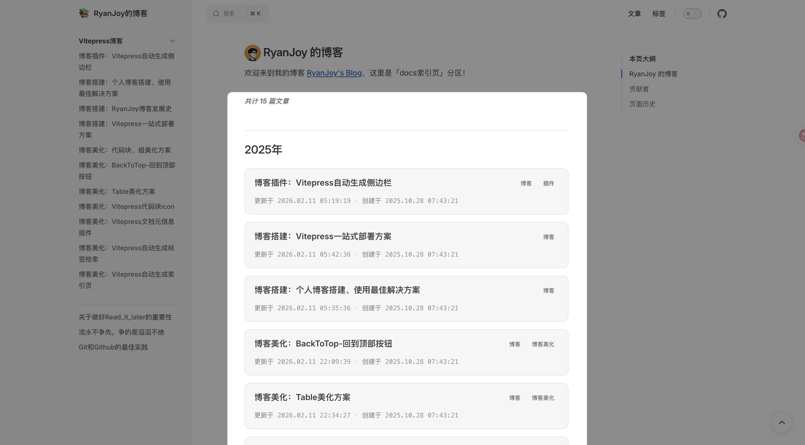

# 博客美化：Vitepress自动生成索引页

> [!warning] 作者说
> 本文档旨在说明如何根据 文档创建时间 **自动生成索引页**。此实现并非是通过 `npm` 依赖包导入插件，而是自定义 `vue` 组件，并使用官方文档提供的 [`createContentLoader`](https://vitepress.dev/zh/guide/data-loading#createcontentloader)  字段来帮助我们简化实现。
> 本文档提供无脑式配置教程，如果需要理解实现原理，请参考 [官方文档](https://vitepress.dev/zh/guide/data-loading) 。

## 效果展示



## 前置介绍

### 组件使用前提

我在 `2025-02-06 10:53:51` 进行了一轮小规模更新，把 [博客美化：Vitepress自动生成标签检索](博客美化：Vitepress自动生成标签检索.md)、 [博客美化：Vitepress自动生成索引页](博客美化：Vitepress自动生成索引页.md)、 [博客美化：Vitepress文档元信息组件](博客美化：Vitepress文档元信息组件.md) 进行了功能联动，简化了一些功能函数的重复定义。

所以如果要配置此组件，首先需要配置完成 [博客美化：Vitepress自动生成标签检索](博客美化：Vitepress自动生成标签检索.md) 组件。

### 项目结构明晰

要想能够成功的在您的 `Vitepress` 博客中进行此实现，我必须为您进行一些前置介绍。

我的文档结构如下。

```shell [powershell]
get1024.github.io
|-- otherDocs
|   |-- 联系我.md
|   |-- index.md
|   |-- ...
|-- docs
|   |-- 🏙️生活技巧/...
|   |-- 👨🏼‍💻个人项目/...
|   |-- 💻操作系统/...
|   |-- 🖥️专业技能/...
|   |-- 🤔反思和总结/...
|   |-- 🛠️实用工具/...
|   |-- index.md
|-- node_modules/...
|-- public/...
|-- index.md
```

易见我的项目结构没有 `'/docs/'` 存在，不过不必慌张，这一因素造成的区别也只会体现在 `Vitepress` 配置文件 `config.ts` 中的 [`base:`](https://vitepress.dev/zh/reference/site-config#base) 选项。我相信你在最初构建项目时，就已经完成了对它的配置。

我需要展示在 索引列表 的笔记只是 `'docs/'` 目录下的。至于 `'/otherDocs/'` 和 `'/index.md'` 都是通过 `config.mts` 文件中的 [`nav` 配置](https://vitepress.dev/zh/reference/default-theme-config#nav) 指向的。

这么安排主要是因为，我要搭建的是一个「博客」而不是其它的什么东西，因此除了 `'docs/'` 目录下的内容都不需要出现在索引页中。

### 文档结构明晰

由于本实现是根据「文档创建时间」进行分组、排序……等需求，这就要求每篇 `markdown` 文档前必须有 `frontmatter` 配置。

有几个必要选项如下

```md [example.md]
---
title:  文章标题
createAt:  YYYY-MM-DD HH:mm:ss
updateAt:  YYYY-MM-DD HH:mm:ss
tags：
	- tag1
	- tag2
---
```

`title` 是文档的标题；

`createAt` 是文章创建的时间， `updateAt` 是文章最近一次编辑的时间。二者的格式均为 `YYYY-MM-DD HH:mm:ss` 。

对于每篇文档中的这三个字段，您可以手动输入配置，或通过一些插件进行实现。由于笔者是基于 [Obsidian](https://obsidian.md/) 进行文档编写，我采用了 [插件](博客搭建：个人博客搭建、使用最佳解决方案.md#文件配置) 实现文档格式化，自动添加以上三个属性。如果读者有更好的实现方案，请访问 [本仓库](https://github.com/get1024/get1024.github.io) `fork` 并提出 `PR` 。

对于上述配置如果您还有自己的需求，当然可以进行更多的键值对 `[属性名]: [属性值]` 配置。

> 这一段内容我重复编写了很多次，如果感兴趣，可以看[文件配置](博客搭建：个人博客搭建、使用最佳解决方案.md#文件配置)、[前提条件](博客美化：Vitepress自动生成标签检索.md#前提条件)。

## 组件定义

### 索引列表脚本

新建 `📄:.vitepress/theme/components/PostList/note.data.ts` 文件，填写内容如下：

```ts [node.data.ts]
import { createContentLoader } from "vitepress";
import { processPost, sortPostsByDate, Post } from "./dateUtils";

// Helper function to group posts by year
function groupByYear(posts: Post[]) {
    return posts.reduce((acc, post) => {
        const year = post.frontmatter.createAt.year;
        if (!acc[year]) {
            acc[year] = [];
        }
        acc[year].push(post);
        return acc;
    }, {} as Record<number, Post[]>);
}

export default createContentLoader("docs/**/*.md", { // [!code warning]
    transform(rawPosts) {
        // Process posts
        const processedPosts = rawPosts.map(processPost);
        // Sort by date (descending) before grouping
        const sortedPosts = sortPostsByDate(processedPosts);
        // Group by year
        return groupByYear(sortedPosts);
    },
});
```

特别需要注意的是 `"📒文章/**/*.md"` 参数，对于你的文档配置，若你想要输出 `'/A'` 文件夹下的所有 `markdown` 文档到 索引页 ，将参数修改为 `"A/**/*.md"` ；若你想要输出 `根目录` 下的所有 `markdown` 文档到 索引页，将参数修改为 `"**/*.md"` 。

::: details 为什么这么写？

我们以 `"📒文章/**/*.md"` 举例，这里 `"📒文章/"` 表示需要检索的 `路径起始位置` ； `"**/"` 表示需要 `嵌套检索` ，直到检索到最深层级； `"*.md"` 表示 `所有以'.md'结尾` 的文件

:::

### 配置 Vue 组件

> [!IMPORTANT] 组件接口变更 (2026-02-11 v1.1.0)
> `PostList` 组件已简化 Props 接口，仅接收 `posts` 数组，内部自动处理样式和日期格式化。请确保 `noteIndex.vue` 中传递的 `posts` 数据结构符合 `Post` 类型定义。

新建 `📄:.vitepress/theme/components/PostList/noteIndex.vue` 文件，复制粘贴下述内容

```vue [nodeIndex.vue]
<script setup>
import { data as posts } from './note.data.ts'
import PostList from './PostList.vue'

// 计算文章总数
const totalPosts = Object.values(posts).reduce((sum, yearPosts) => sum + yearPosts.length, 0)

const groupedPosts = Object.entries(posts)
  .map(([year, yearPosts]) => ({
    year,
    posts: yearPosts // note.data.ts 已经对 posts 进行了排序
  }))
  .sort((a, b) => Number(b.year) - Number(a.year)); // 按年份降序排序
</script>

<template>
  <div class="note-index">
    <p class="total-posts marker-fakeTitle">共计 {{ totalPosts }} 篇文章</p> <!-- [!code warning] -->
    <div v-for="group in groupedPosts" :key="group.year" class="year-group">
      <h2 class="noteIndex-h2">{{ group.year }}年</h2>
      <PostList :posts="group.posts" />
    </div>
  </div>
</template>

<style scoped>
.note-index {
  display: flex;
  flex-direction: column;
  gap: 32px;
}

.total-posts {
  margin-bottom: 1rem;
  color: var(--vp-c-text-2);
  font-size: 0.9rem;
}

.year-group {
  display: flex;
  flex-direction: column;
}

h2.noteIndex-h2 {
  font-weight: 600;
  font-size: 1.5rem;
  margin-top: 0;
  margin-bottom: 24px;
  color: var(--vp-c-text-1);
  display: flex;
  align-items: center;
}
</style>
```

高亮代码可以根据自定义修改。

## 组件注册

在 Vitepress 样式配置文件 `.vitepress/theme/index.ts` 中进行配置。

```ts [index.ts]
//.vitepress/theme/index.ts
import nodeIndex from "./components/noteIndex.vue" // 导入组件定义文件 [!code ++]
//...
export const Theme: ThemeConfig = {
	  extends: DefaultTheme,
	  //...
	  enhanceApp({ app, router}) {
		//...
		app.component('nodeIndex',nodeIndex) //注册组件 [!code ++]
		//...
	  }
}
```

## 组件使用

我选择把索引页放在 `📒文章/index.md` 中， 文章索引页 源代码如下

```md [📒文章/index.md]
---
title: 文章索引页
createAt: 2024-04-29 21:50:23
updateAt: 2025-02-02 23:43:34
tags:
  - Index
  - Info
  - 博客
---

# 文章索引页

## <p><span>RyanJoy 的博客</span></p>

👏欢迎来到我的博客 [RyanJoy's Blog](https://blog.ryanjoy.top/)，这里是「📒文章索引页」分区！

<span class="marker-underline">***左侧*** 是</span><span class="marker-fakeTitle">📒文章分类</span><span class="marker-underline">，***下方*** 是</span><span class="marker-fakeTitle">📒文章更新时间树</span><span class="marker-underline">。选择一种方式进行 `浏览` 寻找你感兴趣的文章，或者 `ctrl+k` 搜索你需要的文章查阅吧！</span>

<nodeIndex />
```

## 兼容性说明

本组件依赖 VitePress 的数据加载器 API 及 Vue 3 的组合式 API，请确保您的项目满足以下最低版本要求：

| 依赖项 | 最低版本 | 说明 |
| :--- | :--- | :--- |
| VitePress | `^1.0.0` | 依赖 `createContentLoader` API |
| Node.js | `>=18.0.0` | 推荐使用 LTS 版本 |
| pnpm | `^8.0.0` | 包管理器推荐 |

推荐在 `package.json` 中配置 `engines` 字段以确保环境一致性：

```json [package.json]
{
  "engines": {
    "node": ">=18.0.0",
    "pnpm": ">=8.0.0"
  }
}
```

## FAQ

以下是基于 `.vitepress/theme/components/PostList` 源码的常见问题解答：

### Q1: 为什么我的文章没有显示在列表中？
**A**: 请检查文章的 frontmatter 配置，确保 `createAt` 字段存在且格式正确。组件依赖 `dateUtils.ts` 进行日期解析。

```ts [dateUtils.ts]
// 确保日期格式为 YYYY-MM-DD HH:mm:ss
const date = new Date(post.frontmatter.createAt);
if (isNaN(date.getTime())) {
    // 日期解析失败会导致文章被忽略或排序异常
}
```

### Q2: 如何修改文章排序规则？
**A**: 排序逻辑位于 `note.data.ts` 中的 `transform` 函数。默认按日期降序排列。

```ts [note.data.ts]
// Sort by date (descending) before grouping
const sortedPosts = sortPostsByDate(processedPosts);
```

### Q3: 组件样式与我的主题不匹配怎么办？
**A**: `PostList.vue` 使用了 VitePress 的 CSS 变量（如 `var(--vp-c-text-1)`），通常会自动适配。如果需要自定义，请覆盖 `.post-item` 等类名。

```css [PostList.vue]
.post-item {
    background-color: var(--vp-c-bg-soft); /* 适配深色/浅色模式 */
    border: 1px solid var(--vp-c-divider);
}
```

### Q4: 为什么 `groupByYear` 函数将文章按年份分组？
**A**: 这是为了在索引页按年份展示归档。如果需要按月份分组，可以修改 `note.data.ts` 中的 `groupByYear` 逻辑。

```ts [note.data.ts]
function groupByYear(posts: Post[]) {
    return posts.reduce((acc, post) => {
        const year = post.frontmatter.createAt.year;
        // ...
    }, {} as Record<number, Post[]>);
}
```

### Q5: 如何更改扫描的文档路径？
**A**: 修改 `createContentLoader` 的第一个参数。

```ts [note.data.ts]
// 扫描 docs 目录下所有 markdown 文件
export default createContentLoader("docs/**/*.md", {
    // ...
});
```
