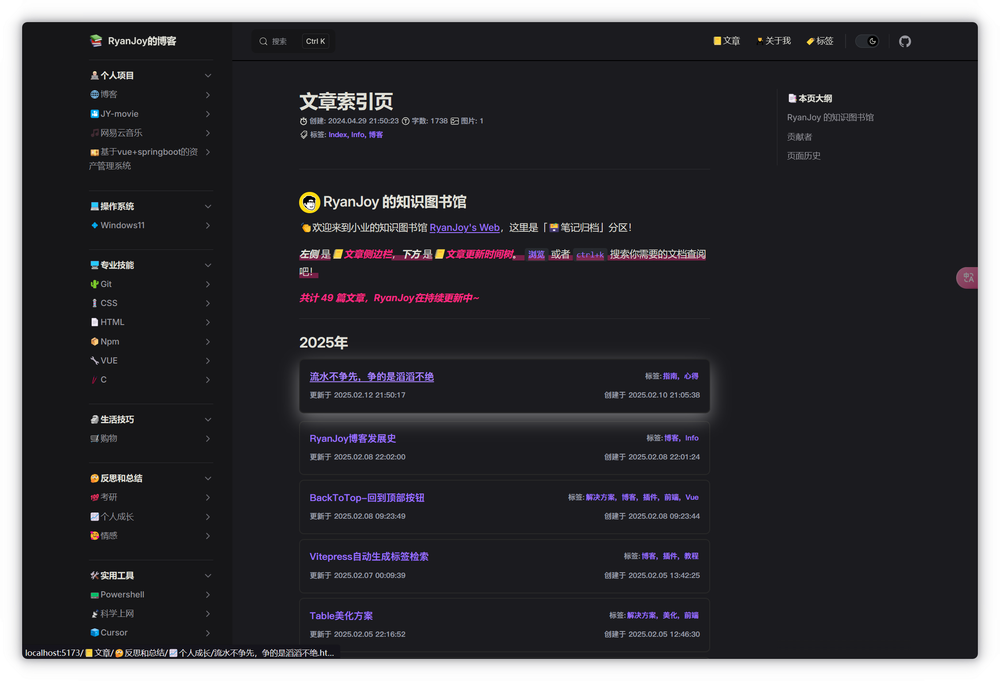

# 博客美化：Vitepress自动生成索引页

> [!warning] 作者说
> 本文档旨在说明如何根据 文档创建时间 **自动生成索引页**。此实现并非是通过 `npm` 依赖包导入插件，而是自定义 `vue` 组件，并使用官方文档提供的 [`createContentLoader`](https://vitepress.dev/zh/guide/data-loading#createcontentloader)  字段来帮助我们简化实现。
> 本文档提供无脑式配置教程，如果需要理解实现原理，请参考 [官方文档](https://vitepress.dev/zh/guide/data-loading) 。

## 效果展示



## 前置介绍

### 组件使用前提

我在 `2025-02-06 10:53:51` 进行了一轮小规模更新，把 [博客美化：Vitepress自动生成标签检索](博客美化：Vitepress自动生成标签检索.md)、 [博客美化：Vitepress自动生成索引页](博客美化：Vitepress自动生成索引页.md)、 [博客美化：Vitepress文档元信息组件](博客美化：Vitepress文档元信息组件.md) 进行了功能联动，简化了一些功能函数的重复定义。

所以如果要配置此组件，首先需要配置完成 [博客美化：Vitepress自动生成标签检索](博客美化：Vitepress自动生成标签检索.md) 组件。

### 项目结构明晰

要想能够成功的在您的 `Vitepress` 博客中进行此实现，我必须为您进行一些前置介绍。

我的文档结构如下。

```shell [powershell]
get1024.github.io
|-- otherDocs
|   |-- 联系我.md
|   |-- index.md
|   |-- ...
|-- docs
|   |-- 🏙️生活技巧/...
|   |-- 👨🏼‍💻个人项目/...
|   |-- 💻操作系统/...
|   |-- 🖥️专业技能/...
|   |-- 🤔反思和总结/...
|   |-- 🛠️实用工具/...
|   |-- index.md
|-- node_modules/...
|-- public/...
|-- index.md
```

易见我的项目结构没有 `'/docs/'` 存在，不过不必慌张，这一因素造成的区别也只会体现在 `Vitepress` 配置文件 `config.ts` 中的 [`base:`](https://vitepress.dev/zh/reference/site-config#base) 选项。我相信你在最初构建项目时，就已经完成了对它的配置。

我需要展示在 索引列表 的笔记只是 `'docs/'` 目录下的。至于 `'/otherDocs/'` 和 `'/index.md'` 都是通过 `config.mts` 文件中的 [`nav` 配置](https://vitepress.dev/zh/reference/default-theme-config#nav) 指向的。

这么安排主要是因为，我要搭建的是一个「博客」而不是其它的什么东西，因此除了 `'docs/'` 目录下的内容都不需要出现在索引页中。

### 文档结构明晰

由于本实现是根据「文档创建时间」进行分组、排序……等需求，这就要求每篇 `markdown` 文档前必须有 `frontmatter` 配置。

有几个必要选项如下

```md [example.md]
---
title:  文章标题
createAt:  YYYY-MM-DD HH:mm:ss
updateAt:  YYYY-MM-DD HH:mm:ss
tags：
	- tag1
	- tag2
---
```

`title` 是文档的标题；

`createAt` 是文章创建的时间， `updateAt` 是文章最近一次编辑的时间。二者的格式均为 `YYYY-MM-DD HH:mm:ss` 。

对于每篇文档中的这三个字段，您可以手动输入配置，或通过一些插件进行实现。由于笔者是基于 [Obsidian](https://obsidian.md/) 进行文档编写，我采用了 [插件](博客搭建：个人博客搭建、使用最佳解决方案.md#文件配置) 实现文档格式化，自动添加以上三个属性。如果读者有更好的实现方案，请访问 [本仓库](https://github.com/get1024/get1024.github.io) `fork` 并提出 `PR` 。

对于上述配置如果您还有自己的需求，当然可以进行更多的键值对 `[属性名]: [属性值]` 配置。

> 这一段内容我重复编写了很多次，如果感兴趣，可以看[文件配置](博客搭建：个人博客搭建、使用最佳解决方案.md#文件配置)、[前提条件](博客美化：Vitepress自动生成标签检索.md#前提条件)。

## 组件定义

### 索引列表脚本

新建 `📄:.vitepress/theme/components/PostList/note.data.ts` 文件，填写内容如下：

```ts [node.data.ts]
import { createContentLoader } from "vitepress";
import { processPost, Post } from "./dateUtils";

function groupByYear(posts: Post[]) {
    return posts.reduce((acc, post) => {
        const year = post.frontmatter.createAt.year;
        if (!acc[year]) {
            acc[year] = [];
        }
        acc[year].push(post);
        return acc;
    }, {} as Record<number, Post[]>);
}

export default createContentLoader("📒文章/**/*.md", { // [!code warning]
    transform(rawPosts) {
        const processedPosts = rawPosts.map(processPost);
        return groupByYear(processedPosts);
    },
});
```

特别需要注意的是 `"📒文章/**/*.md"` 参数，对于你的文档配置，若你想要输出 `'/A'` 文件夹下的所有 `markdown` 文档到 索引页 ，将参数修改为 `"A/**/*.md"` ；若你想要输出 `根目录` 下的所有 `markdown` 文档到 索引页，将参数修改为 `"**/*.md"` 。

::: details 为什么这么写？

我们以 `"📒文章/**/*.md"` 举例，这里 `"📒文章/"` 表示需要检索的 `路径起始位置` ； `"**/"` 表示需要 `嵌套检索` ，直到检索到最深层级； `"*.md"` 表示 `所有以'.md'结尾` 的文件

:::

### 配置 Vue 组件

新建 `📄:.vitepress/theme/components/PostList/noteIndex.vue` 文件，复制粘贴下述内容

```vue [nodeIndex.vue]
<script setup>
import { data as posts } from './note.data.ts'
import PostList from './PostList.vue'

const totalPosts = Object.values(posts).reduce((sum, yearPosts) => sum + yearPosts.length, 0)

const groupedPosts = Object.entries(posts)
  .map(([year, yearPosts]) => ({
    year,
    posts: yearPosts.sort((a, b) => {
      const aDate = a.frontmatter.createAt;
      const bDate = b.frontmatter.createAt;
      if (bDate.month !== aDate.month) {
        return bDate.month - aDate.month;
      }
      if (bDate.day !== aDate.day) {
        return bDate.day - aDate.day;
      }
      if (bDate.hour !== aDate.hour) {
        return bDate.hour - aDate.hour;
      }
      if (bDate.minute !== aDate.minute) {
        return bDate.minute - aDate.minute;
      }
      if (bDate.second !== aDate.second) {
        return bDate.second - aDate.second;
      }
      return 0;
    }),
  }))
  .sort((a, b) => b.year - a.year);
</script>

<template>
  <div class="note-index">
    <p class="total-posts marker-fakeTitle">共计 {{ totalPosts }} 篇文章，RyanJoy在持续更新中~</p> <!-- [!code warning] -->
    <div v-for="group in groupedPosts" :key="group.year">
      <h2 class="noteIndex-h2">{{ group.year }}年</h2>
      <PostList :posts="group.posts" />
    </div>
  </div>
</template>

<style scoped>
.total-posts {
  margin-bottom: 1rem;
}

h2.noteIndex-h2 {
  font-weight: bold;
  font-size: 1.5em;
  margin-top: 20px;
}
</style>
```

高亮代码可以根据自定义修改。

## 组件注册

在 Vitepress 样式配置文件 `.vitepress/theme/index.ts` 中进行配置。

```ts [index.ts]
//.vitepress/theme/index.ts
import nodeIndex from "./components/noteIndex.vue" // 导入组件定义文件 [!code ++]
//...
export const Theme: ThemeConfig = {
	  extends: DefaultTheme,
	  //...
	  enhanceApp({ app, router}) {
		//...
		app.component('nodeIndex',nodeIndex) //注册组件 [!code ++]
		//...
	  }
}
```

## 组件使用

我选择把索引页放在 `📒文章/index.md` 中， 文章索引页 源代码如下

```md [📒文章/index.md]
---
title: 文章索引页
createAt: 2024-04-29 21:50:23
updateAt: 2025-02-02 23:43:34
tags:
  - Index
  - Info
  - 博客
---

# 文章索引页

## <p><span>RyanJoy 的博客</span></p>

👏欢迎来到我的博客 [RyanJoy's Blog](https://blog.ryanjoy.top/)，这里是「📒文章索引页」分区！

<span class="marker-underline">***左侧*** 是</span><span class="marker-fakeTitle">📒文章分类</span><span class="marker-underline">，***下方*** 是</span><span class="marker-fakeTitle">📒文章更新时间树</span><span class="marker-underline">。选择一种方式进行 `浏览` 寻找你感兴趣的文章，或者 `ctrl+k` 搜索你需要的文章查阅吧！</span>

<nodeIndex />
```